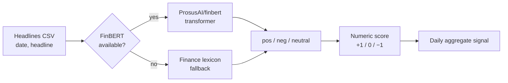

<div align="center">

# 📰 FinBERT Market-Sentiment Analyzer

**Turn financial headlines into a daily sentiment signal — with a graceful offline fallback.**


</div>

Runs financial headlines through **FinBERT** (a BERT fine-tuned on financial text) to label each
as positive / negative / neutral, then aggregates a **per-day sentiment signal** you can line up
against price action. If `transformers`/`torch` aren't installed — or you're offline — it falls
back to a compact finance lexicon so the pipeline *always* runs end to end in one command.

---

## How it works



## Quickstart

```bash
pip install -r requirements.txt          # transformers+torch optional; pandas is enough
python sentiment.py --csv sample_headlines.csv
```

```
2025-01-02  Apple beats earnings expectations as iPhone sales surge   positive
2025-01-02  Regional banks plunge amid rate-cut fears                  negative
...
--- Daily aggregate sentiment signal ---
2025-01-02   0.0
2025-01-03   0.0
```

## Why the fallback matters

A model demo that only runs if a 400 MB model downloads successfully isn't a demo — it's a
liability. The lexicon fallback means the whole pipeline (ingest → classify → aggregate) is
reproducible on any machine, and installing `transformers` + `torch` simply upgrades the
classifier in place.

## Project structure

```
finbert-sentiment-analyzer/
├── sentiment.py          # FinBERT pipeline + lexicon fallback + daily aggregation
├── sample_headlines.csv  # bring your own: needs date, headline columns
├── requirements.txt
└── README.md
```

## Extending it

- Join the daily signal to a price series and test whether sentiment leads returns.
- Add source weighting (a Bloomberg headline ≠ a random tweet).
- Swap in a domain-specific model or fine-tune FinBERT on your own labeled set.

<div align="center"><sub>Built by <a href="https://github.com/adrian-erlikhman">Adrian Erlikhman</a> · MIT License</sub></div>
