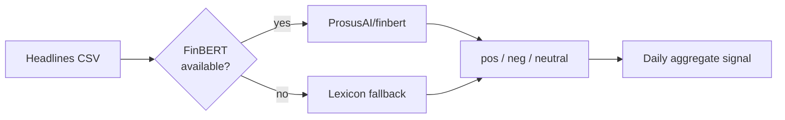

# 📰 FinBERT Market-Sentiment Analyzer

  

Turns financial headlines into a daily sentiment signal with **FinBERT** — plus a lexicon fallback so the pipeline runs even offline.



**How** — FinBERT tags each headline, then aggregates a per-day score you can line up against price. No `transformers`/`torch`? It falls back to a finance lexicon so it always runs end to end.

## Run
```bash
pip install -r requirements.txt
python sentiment.py --csv sample_headlines.csv   # date, headline columns
```

<sub>MIT · Adrian Erlikhman</sub>
