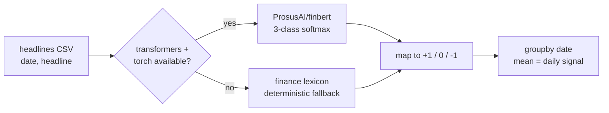

# FinBERT Market-Sentiment Analyzer

Maps financial headlines to a daily sentiment signal with **FinBERT** (`ProsusAI/finbert`), a BERT model fine-tuned on the Financial PhraseBank. Degrades to a deterministic finance lexicon when `transformers`/`torch` or the model weights are unavailable, so the pipeline runs end-to-end offline.

  



## Model

FinBERT is BERT-base fine-tuned for 3-class financial sentiment. Each headline is tokenized (WordPiece, 30k vocab) and passed through 12 transformer encoder layers; the `[CLS]` representation feeds a linear head with a softmax over $\{\text{positive}, \text{negative}, \text{neutral}\}$. The pipeline takes $\arg\max$ of the softmax as the label. Domain fine-tuning matters here: general-purpose sentiment models misread finance phrasing ("beat estimates", "misses guidance", "cut outlook") that FinBERT was trained on.

## Signal construction

Labels are mapped to a scalar polarity $\ell \in \{+1, 0, -1\}$ and aggregated to a per-day signal:

$$S_d=\frac{1}{|H_d|}\sum_{h\in H_d}\ell(h)\in[-1,+1]$$

where $H_d$ is the set of headlines on date $d$. $S_d$ is directly comparable across days and can be lined up against returns or used as a feature.

## Fallback

If `transformers`/`torch` cannot be imported or the weights cannot be fetched, the loader catches the exception and swaps in a signed finance lexicon (`net = |positive terms| − |negative terms|`, sign gives the label). Deterministic, dependency-free, and enough to exercise the full CSV → label → daily-aggregate path in CI or offline. The active scorer is logged at runtime.

## Reproduce

```bash
pip install -r requirements.txt
python sentiment.py --csv sample_headlines.csv   # columns: date, headline
```

Output: per-headline labels, then the daily aggregate signal $S_d$. First FinBERT run downloads ~440 MB of weights; subsequent runs are cached. With no `transformers`/`torch` installed it runs immediately on the lexicon fallback.

## Limitations

- The lexicon fallback is a smoke test, not a substitute for FinBERT quality; it is bag-of-words and misses negation and context.
- Headline-level sentiment is a weak, noisy predictor of returns on its own; treat $S_d$ as one feature, not a signal in isolation.

MIT.
